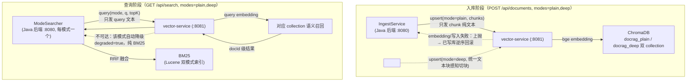

# doc-rag · 本地文档检索与问答系统

纯本地部署的文档检索问答系统，支持 **docx / xlsx / pdf** 三种格式，基于 Lucene BM25 算法检索，可选开启本地语义检索（bge embedding + ChromaDB）。

## 双解析模式

系统核心概念是两种**解析模式**（`mode=plain|deep`），每种模式拥有自己完整的一套「倒排索引 + 向量库」：

| 模式 | 解析方式 | 索引目录 | 向量 collection | 向量切块 |
|---|---|---|---|---|
| **plain 纯文本解析** | Parser 提取纯文本 | `data/index-plain/` | `docrag_plain` | `Chunker.chunk`（128 字符） |
| **deep 深度解析** | 表格→markdown，与正文拼成统一文本 | `data/index-deep/` | `docrag_deep` | `Chunker.chunkKeepingTables`（块感知，表格含标题行整体保留） |

- 入库时可选择 1 个或 2 个模式（默认全选）；检索/问答也按模式选择。
- 检索选双模式时，结果按模式分两栏对比展示；问答双模式时合并两路上下文、一次 LLM 调用，引用标注来源模式。

## 架构

```
浏览器 ── HTTP ── Python Flask 前端 (:3000) ── REST/JSON ── Java Spring Boot 服务 (:8080)
                                                                        │
                                                          ┌─────────────┼─────────────┐
                                                       Parser/deepmd  Indexer 模块   Searcher 模块
                                                       模块           Lucene 写×2    Lucene 读+高亮 ×2
                                                       (plain/deep)   (per-mode)     (per-mode)
                                                                        │
                                                          Vector Client ──► vector-service (:8081)
                                                                        │
                                                              data/index-plain/  data/index-deep/
                                                              data/chroma/（docrag_plain + docrag_deep 双 collection）
```

### vector-service 依赖关系（embedding 全在 vector-service 侧）

Java 后端自身不做 embedding，仅通过 HTTP 与 vector-service 交互；入库与查询两个阶段都依赖它，但失败语义不同——写路径失败上抛回滚，读路径该模式降级纯 BM25。



> 注：问答（`/api/ask`）为纯 BM25 召回，不依赖 vector-service（详见 `docs/召回方式与降级语义.md`）。

| 层 | 技术 | 说明 |
|---|---|---|
| 后端 | Java 17、Spring Boot 3、Maven | REST 服务 (:8080) |
| 检索引擎 | Apache Lucene 8.11 | BM25 打分，本地文件索引（plain/deep 各一套） |
| 中文分词 | IK Analyzer 8.5.0 | 中文按词切分 |
| 文档解析 | Apache POI (docx/xlsx)、PDFBox (pdf) | plain 纯文本 / deep 统一文本（表格→markdown） |
| 向量检索（可选）| Python FastAPI、bge-small-zh-v1.5、ChromaDB | 语义检索 (:8081)，per-mode 双 collection |
| 前端 | Python Flask、Jinja2、原生 CSS/JS | 服务端渲染 (:3000)，双模式分栏对比 |

## 快速开始

### 前置条件

| 依赖 | 版本 | 说明 |
|---|---|---|
| JDK | 17+ | Java 后端 |
| Maven | 3.6+ | 构建工具 |
| Python | 3.10+ | 前端 + 向量服务 |

```bash
# 如系统未设置 JAVA_HOME，先指定（macOS Homebrew 路径）
export JAVA_HOME="$(brew --prefix openjdk@17)/libexec/openjdk.jdk/Contents/Home"
```

### 1. 启动后端（Java Spring Boot）

```bash
cd backend
mvn spring-boot:run
```

后端默认监听 **`:8080`**，索引目录为 `../data/index-plain/`、`../data/index-deep/`，上传目录为 `../data/upload/`（相对 `backend/` 工作目录；从其它目录启动需显式传绝对路径）。

### 2. 启动前端（Flask）

```bash
cd frontend
pip install -r requirements.txt
flask run --host 0.0.0.0 --port 3000
```

前端默认监听 **`:3000`**，打开浏览器访问 `http://localhost:3000`。

### 3. [可选] 启动向量服务（语义检索）

```bash
cd vector-service
pip install -r requirements.txt
uvicorn main:app --host 0.0.0.0 --port 8081
```

向量服务使用 **bge-small-zh-v1.5** 模型本地编码，首次启动会自动下载模型（约 130MB）。模型下载完成后会在运行时离线工作，数据不出机。

向量服务默认监听 **`:8081`**，内部维护 `docrag_plain` / `docrag_deep` 两个 ChromaDB collection（分别存放两种模式的向量）。如不需要语义检索，跳过此步即可——各模式自动降级为纯 BM25 关键词检索。

## API 文档

### POST `/api/documents` — 上传并入库

- **请求**: `multipart/form-data`，字段 `file` + `modes`（逗号串，可选 `plain,deep`，默认 `plain,deep`）
- **响应**:
```json
{
  "docId": "550e8400-e29b-41d4-a716-446655440000",
  "filename": "合同.docx",
  "type": "docx",
  "modes": ["plain", "deep"],
  "chunkCount": {"plain": 5, "deep": 3},
  "tableCount": 2
}
```

`tableCount` 仅 deep 模式选中时返回；任一库写入失败整体回滚。

### GET `/api/search?q=关键词&page=1&size=10&modes=plain,deep` — 检索

- `modes` 默认 `plain`；响应统一嵌套形状（单双模式同构）：
```json
{
  "modes": {
    "plain": {
      "total": 12,
      "degraded": false,
      "hits": [
        {
          "docId": "uuid",
          "filename": "合同.docx",
          "path": "data/upload/...",
          "type": "docx",
          "snippet": "其中<em>合同条款</em>约定……",
          "score": 3.42,
          "source": "both"
        }
      ]
    },
    "deep": { "total": 8, "degraded": true, "hits": [] }
  }
}
```

`source`: `bm25`（仅关键词）/ `vector`（仅语义）/ `both`（混合召回 RRF 融合）；`degraded` 为该模式向量服务不可用降级标记。

### GET `/api/documents/{docId}` — 取 plain 索引原文

- **响应**:
```json
{
  "docId": "uuid",
  "filename": "合同.docx",
  "path": "data/upload/...",
  "type": "docx",
  "modified": 1750000000000,
  "content": "plain 模式写入索引的完整纯文本"
}
```

deep 模式统一文本明细走 `GET /api/store/deep/{docId}`。

### DELETE `/api/documents/{docId}` — 删除

- 级联删除两模式倒排与两向量 collection 中该文档（上传原文保留）

### POST `/api/debug/parse` — Debug 解析（不入库）

- **请求**: `multipart/form-data`，字段 `file`（仅支持 docx/xlsx）
- **响应**:
```json
{
  "filename": "员工表.docx",
  "type": "docx",
  "imageCount": 2,
  "tableCount": 1,
  "tablesTruncated": false,
  "textTruncated": false,
  "indexedText": "拍平的索引文本……",
  "tables": [
    { "title": "表格 1", "rows": [["姓名", "年龄"], ["张三", "25"]] }
  ]
}
```

## 前端页面

| 页面 | 路径 | 说明 |
|---|---|---|
| 搜索页 | `/` | 上传文件（可选模式）、关键词检索（可选 1-2 模式，双模式分栏对比）、结果高亮、内嵌问答 |
| Debug 解析 | `/debug` | 上传文件查看结构化解析结果，对比拍平文本 |
| 原文查看 | `/doc/<docId>` | plain 栏「查看原文」按钮惰性加载 |
| 明细页 | `/store/plain`、`/store/deep` | 两模式索引明细列表与入库文本查看 |

## 数据流

### 入库流程（每模式独立，可只选其一）

```
用户上传（勾选模式） → 落盘 data/upload/
  → plain: Parser 提取纯文本          → plain 倒排 (data/index-plain/) + docrag_plain 向量
  → deep:  deepmd 提取统一文本        → deep 倒排 (data/index-deep/)  + docrag_deep 向量
  （任一库失败 → 已写库逆序回滚）
```

### 检索流程（每模式独立执行）

```
用户输入关键词 + 模式选择
  → IK 分词 → Lucene MultiFieldQueryParser (filename + content)
  → BM25 打分召回 Top-50
  → 并行: VectorClient 语义召回 Top-50（查该模式 collection，如可用）
  → RRF 融合排序 (k=60)
  → Highlighter 截取最佳片段（<em> 包裹命中词）
  → 按模式分栏返回 JSON
```

## 索引字段 Schema（plain / deep 同构）

| 字段 | 类型 | 说明 |
|---|---|---|
| `id` | StringField | docId，唯一标识与级联删除键 |
| `filename` | TextField (IK) | 文件名，参与检索 |
| `path` | StringField | 文件存储路径 |
| `type` | StringField | docx / xlsx / pdf |
| `modified` | StoredField | 上传时间戳 |
| `content` | TextField (IK) | plain=纯文本 / deep=统一文本，存储用于高亮 |

## 配置

所有路径集中在 `backend/src/main/resources/application.yml`：

```yaml
server:
  port: 8080

spring:
  servlet:
    multipart:
      max-file-size: 50MB
      max-request-size: 55MB

docrag:
  upload-dir: ../data/upload
  plain-index-dir: ../data/index-plain
  deep-index-dir: ../data/index-deep
  vector-service-url: http://127.0.0.1:8081
```

## 测试

```bash
# 后端 JUnit5
cd backend && mvn test

# 前端 pytest
cd frontend && pip install -r requirements.txt && pytest
```

## 目录结构

```
doc-rag/
├── backend/                    # Java Maven 工程
│   ├── pom.xml
│   └── src/main/java/com/docrag/
│       ├── mode/                # Mode 枚举（plain|deep）
│       ├── api/                 # REST Controller
│       ├── parser/              # plain 模式文档解析器
│       ├── deepmd/              # deep 模式统一文本提取（表格→markdown）
│       ├── indexer/             # ModeIndexer（per-mode Lucene 写入）+ IngestService + Chunker
│       ├── searcher/            # ModeSearcher（per-mode 检索 + 高亮）
│       ├── ask/                 # LLM 问答编排
│       ├── debug/               # Debug 解析服务
│       ├── vector/              # 向量服务 HTTP 客户端（per-mode）
│       └── config/              # 配置项 + 双模式索引生命周期
├── frontend/                   # Python Flask 应用
│   ├── app.py
│   ├── templates/
│   ├── static/
│   └── requirements.txt
├── vector-service/             # 向量服务（可选，双 collection）
│   ├── main.py
│   └── requirements.txt
├── data/
│   ├── upload/                 # 上传原文
│   ├── index-plain/            # plain 倒排索引
│   ├── index-deep/             # deep 倒排索引
│   └── chroma/                 # ChromaDB 向量库（docrag_plain + docrag_deep）
└── CLAUDE.md                   # 架构宪法
```

## 技术要点

- **IK 双分词器策略**: 索引侧细粒度（`useSmart=false`）保证召回，查询侧智能切分（`useSmart=true`）贴近用户意图。高亮时索引侧分词器重切文本对齐 offset。
- **RRF 融合排序**: 两路召回（BM25 + 语义）各自排序后，按 `score = Σ 1/(k + rank)` 融合，k=60；plain 与 deep 模式独立执行。
- **自动降级**: 向量服务不可用时该模式自动降级为纯 BM25 关键词检索，per-mode `degraded=true` 标记。
- **HTML 安全**: 后端对原文做 HTML 转义后保留 `<em>` 高亮标记，前端用 Jinja2 `|safe` 渲染。

## TODO

- [ ] PDF 表格解析：docx / xlsx 已支持表格解析为 markdown（进入 deep 模式统一文本），PDF 目前 deep 模式仅纯文本、无结构化表格，待引入 PDF 表格识别能力。
