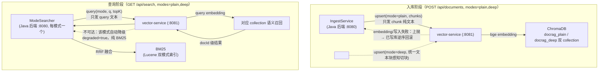

# vector-service —— bge + ChromaDB 语义召回服务（:8081，可选）

> 本文回答：embedding 为什么全放在这个 Python 侧服务而不是 Java 后端？模型与相似度空间怎么选的？双 collection 怎么管理？为什么 Java 客户端强制 HTTP/1.1？
> 实现：`vector-service/main.py`（FastAPI，单文件）+ 本地模型快照 `vector-service/models/bge-small-zh-v1.5/`。

## 1. 定位与依赖关系

vector-service 是**可选**的语义召回服务：不启动它，检索/问答自动降级纯 BM25（per-mode `degraded=true`），上传与一键清理则会被拒绝（见《[检索与召回](检索与召回.md)》§4 降级矩阵）。

Java 后端自身不做 embedding，仅通过 HTTP 交互；入库与查询两阶段都依赖它，但失败语义不同：

### 为什么 embedding 全在侧服务（Java 不跑模型）

- **生态**：sentence-transformers / bge 是 Python 生态，Java 侧跑同等模型要 DJL/onnx 那条路，模型加载与 CPU 推理调优成本远高于「起一个 FastAPI 进程」；
- **隔离**：模型加载（约 130MB、首次联网）与推理延迟被挡在后端进程外，vector-service 挂掉后端照常跑纯 BM25；
- **边界**：后端只发纯文本、收 docId/similarity，两进程间无模型概念泄漏——换 embedding 模型不动 Java 代码。

### 模型选型：bge-small-zh-v1.5

中文检索小模型（512 token 上限）。**查询侧加指令前缀** `QUERY_PREFIX = "为这个句子生成表示以用于检索相关文章："`（bge 官方要求：查询加指令、文档不加）。入库编码 `normalize_embeddings=True`，collection 相似度空间 cosine，`similarity = 1.0 - distance`。模型优先加载项目内快照 `vector-service/models/bge-small-zh-v1.5/`（离线可用、版本锁定），目录不存在才回退 HuggingFace id `BAAI/bge-small-zh-v1.5`。

## 2. 双 collection

| collection | 内容 | chunk 来源 |
|---|---|---|
| `docrag_plain` | plain 纯文本 chunk | `Chunker.chunk(128)` |
| `docrag_deep` | deep 统一文本块感知 chunk | `Chunker.chunkKeepingTables(256)`，表格块整体保留 |

- 命名 `_collection_name(mode) → "docrag_{mode}"`，启动时对两模式 `get_or_create_collection`（`metadata={"hnsw:space":"cosine"}`）。
- **为什么双 collection 而非单 collection + mode 元数据过滤**：两模式 chunk 语义空间不同（拍平文本 vs 表格混排），分开存可独立清空/重建/统计；ChromaDB 的 where 过滤不参与 HNSW 索引结构，混存会让两模式的召回互相挤占 topK。
- **chunk id**：`{docId}:{chunkIndex}`，metadata 携带 `{docId, filename, type, chunkIndex}`。
- **并发保护**：模块级 `threading.Lock`，所有读写端点在锁内（FastAPI sync 端点跑线程池；防「清空 collection 后旧句柄失效」一类竞态）。
- 持久化：`chromadb.PersistentClient(path=DOCRAG_CHROMA_DIR)`，默认 `data/chroma/`（gitignore，可删重建）。

## 3. HTTP 端点（7 个，全部在 main.py）

| 方法+路径 | 请求 | 响应 | 要点 |
|---|---|---|---|
| `GET /health` | — | `{status, model, vectors:{plain, deep}}` | 两 collection 计数 |
| `POST /documents` | `{docId, filename, type, mode, chunks:[str]}` | `{chunkCount}` | **先 delete 再 upsert**（`delete(where={"docId"})`）：重传时块数变少，尾部旧 chunk 不清会幽灵命中 |
| `POST /query` | `{text, topK=50, mode}` | `{hits:[{docId, filename, type, chunk, similarity}]}` | 查询侧加 QUERY_PREFIX；空文本/库空返回空 hits |
| `GET /documents?mode=` | mode 默认 plain，非法 400 | `{docs:[{docId, filename, type, chunkCount}]}` | docId 排序聚合，明细页用 |
| `GET /documents/{doc_id}?mode=` | — | `{docId, filename, type, chunks:[{chunkIndex, text}]}` | chunkIndex 升序；不存在 404 |
| `DELETE /documents/{doc_id}?mode=all` | mode 额外接受 `all` | `{deleted, plain:{before,after}, deep:{before,after}}` | where 过滤幂等；级联删除/回滚用 |
| `DELETE /documents?mode=all` | all = 全清 | `{plain:{before,after}, deep:{before,after}}` | **实现是 `delete_collection` + 按原参数（cosine）重建**，不逐条删——一键清理用 |

## 4. 两个工程细节

- **Java 侧 `VectorClient` 强制 HTTP/1.1**：JDK `HttpClient` 默认尝试 HTTP/2，FastAPI（h11）不支持会协商失败返回 422。显式 `.version(HTTP_1_1)` 解决——这是两进程联调时踩过的坑，勿删。
- **写路径失败上抛、读路径降级**：upsert/delete 失败直接抛给 `IngestService` 触发回滚；query 失败由 `ModeSearcher` 捕获转 `degraded=true`。语义划分见《[检索与召回](检索与召回.md)》§4。

## 5. 配置（环境变量）

| 变量 | 默认 | 说明 |
|---|---|---|
| `DOCRAG_EMBED_MODEL` | 项目内 `models/bge-small-zh-v1.5`，否则 `BAAI/bge-small-zh-v1.5` | embedding 模型覆盖 |
| `DOCRAG_CHROMA_DIR` | `<项目根>/data/chroma` | ChromaDB 持久化目录（测试指向临时目录） |
| `DOCRAG_PORT` | `8081` | uvicorn 端口；host 固定 `0.0.0.0` |

启动方式与三服务编排见《[运维与启动](运维与启动.md)》。
